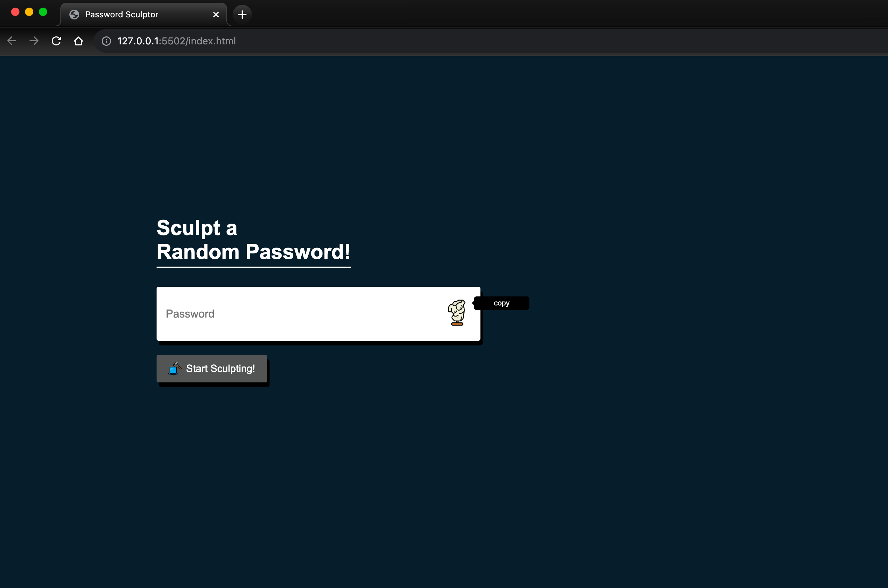
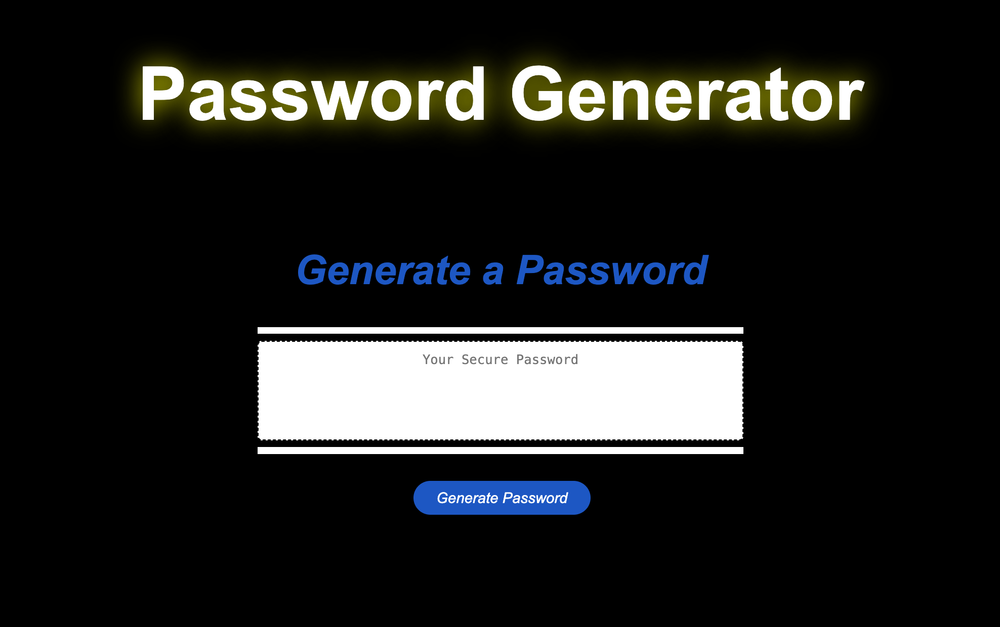
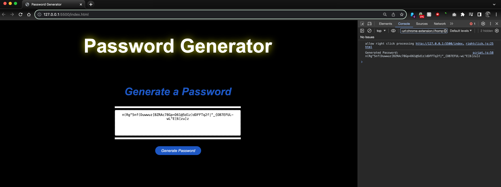

# JavaScript Challenge // Password Generator

##### _Languages & Tools Used_ 🛠

  

#### _Links_
* <a href="https://github.com/F3N215/pw-generator-challenge/blob/main/index.html">HTML</a>
* <a href="https://github.com/F3N215/pw-generator-challenge/blob/main/style.css">CSS</a>
* <a href="https://github.com/F3N215/pw-generator-challenge/blob/main/script.js">JS</a>

-----
## Project Summary 📋
* Using some basic starter code, I was asked to create a password generator application for a client with access to sensitive data 
* The client requires a strong, randomly generated password that offers greater security, at least 8 characters and 128 characters in length 
* A series of prompts allows users to input their designed characters and password length in order to proceed
* Once completed the password displays in the window on the page and within the console
-----
# Initial Work & Study 💻
 
* Searched through previous classes and online tutorials on functions, loops, and conditional gates
* Goal: to understand how functions could be used to call random characters (letters, numbers, symbols) without the application breaking or returning a false value
* Sample prototype via tutorial which taught me what basic JS structure for a password generator might look like
* Completed side project prototype

# Collaboration Workflow 🦾
* After reviewing some of my work with my mentor who helped further my understanding, I reworked the JavaScript to “clean it up”
* Requested information details from Xpert Learning Assistant for assistance on proper syntax and understanding logic behind the code
* Connected with my colleague Sahil for an all-day study session to test various updates and share ideas
* Completed 2nd tutoring session requesting additional explanations and details of JavaScript logic and flow
* Finally, reviewed additional JavaScript course materials and connected a final time with my mentor

# References 📔
* <a href="https://www.youtube.com/watch?v=duNmhKgtcsI">Traversy Media</a>
* <a href="https://www.youtube.com/watch?v=iKo9pDKKHnc">Web Dev Simplifed</a>
* <a href="https://developer.mozilla.org/en-US/docs/Web/JavaScript/Reference/Global_Objects/Math/random">MDN</a>
* <a href="https://www.w3schools.com/js/js_random.asp">W3</a>
* <a href="https://discuss.codecademy.com/t/password-generator-checker/790373">Code Academy</a> 
* <a href="https://www.geeksforgeeks.org/how-to-generate-a-random-password-using-javascript">Geeks for Geeks</a>  

-----
## Summary of Changes 📝


# JavaScript
* Started by laying out a series of constants to define character sets to select and use in the final password
* Added first prompt and defined ‘length’ as a constant in the function body the ‘generatePassword’ function
* This function then “builds” the ‘characters’ string based on user input (boolean)
* After researching ‘isNaN’ I added error messaging to halt ‘generatePassword’ if no inputs are selected by the user
* I appended window.confirm() to a new set of constants that work as alerts. User inputs function as either ‘true’ (OK button) or ‘false’ (Cancel button) — if all inputs are false, or are too short or too long, the error alert displays and returns the user to the start of the process
* Then I used var to make characters into an empty string (or object) and added a series of loops defined by the constants using a boolean (ie true/false = okay/cancel) to populate it
* If all values are false (ie. user selects ‘cancel’ each time) the last loop returns them to the start
* The initialization of the let generatedPassword line creates a string where characters of the password can be stored as the ‘for’ loop progresses X times. I researched random index generation techniques to learn Math.random() multiplied by the length of the string and then multiplied by ‘characters’ length
* Adding Math.floor rounds down to make a whole number (instead of 0-1 expressed as decimal places)
* The last step concatenates password characters one by one using a ‘+=‘ operator
* Finally, the function writePassword() calls the HTML id and displays the stored password on click using an EventListener method

# Other
* Added comments to HTML for clean sections and easier reference to functions in JS
* Added header styling: increased size, added an animated glowing feature on <h1>
* Added colour hover effects to the ‘Generate Password’ button
* Changed background colour for greater visibility/impact
* Added CSS comments for easy reference when changing styling
* Used Chrome extension WAVE to test final page for accessibility.

-----
## Screenshots 📸

<a href="https://streamable.com/jc3307">Short Screen Recording</a>

-----
## About Me
<h3 align="left">Hey there! I'm Dan 👋 I'm a junior fullstack webdev</h3>

* 🔭 I’m currently working on occult projects, SMBs & personal pages
* 🌱 I’m currently learning HTML5, CSS, & JavaScript
* 📫 Email me **dcampo85@gmail.com**

<h6 align="left">Connect with me:</h6>

